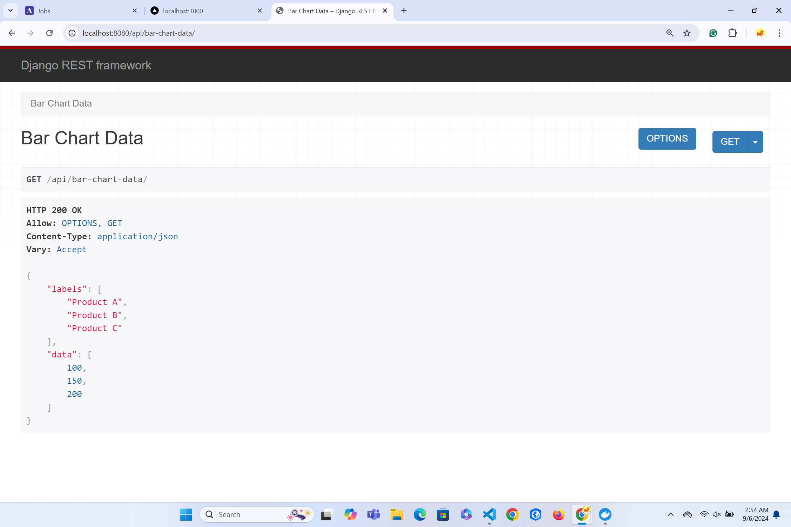

# Project README

## Overview

This project consists of a Django backend and a Next.js frontend, both containerized using Docker. The backend uses PostgreSQL for data storage, and the frontend is built with Next.js, React, and Tailwind CSS.


## Libraries and Tools Used

### Backend
- **Django**: Python-based web framework for building the backend.
- **PostgreSQL**: **Relational** database management system.
- **Docker**: Containerization platform for packaging and deploying the application.
- **docker-compose**: Tool for defining and running multi-container Docker applications.




### Frontend
- **Next.js**: React framework for server-side rendering and static site generation.
- **React**: JavaScript library for building user interfaces.
- **Tailwind CSS**: Utility-first CSS framework for styling.
- **Babel**: JavaScript compiler used for transpiling.
- **Webpack**: Module bundler for JavaScript applications.


## Setup and Running the Application

### Prerequisites

- **Docker**: Ensure Docker and Docker Compose are installed on your machine. You can download and install Docker from [Docker's official site](https://www.docker.com/products/docker-desktop).

### Steps to Run the Application

#### Get Started:

1. **Clone the Repository**
   ```bash
   git clone <repository-url>
   cd <repository-folder>
   ```

2. **Build and Start the Containers**
   ```bash
   docker-compose up --build
   ```
   This command will build the Docker images for both the Django backend and the Next.js frontend, and start the containers. It will also create the PostgreSQL database container.

3. **Access the Application**
   - Frontend: Open your browser and navigate to http://localhost:3000.
   - Backend: The backend API will be running and accessible from within the Docker network. You can configure your frontend to communicate with this API using the Docker service names defined in the docker-compose.yml file.

4. **Migrate Database (if applicable)**
   If you need to apply migrations to the PostgreSQL database, you can do so by running:
   ```bash
   docker-compose exec django-backend python manage.py migrate
   ```

5. **Stop the Containers**
   To stop and remove the containers, use:
   ```bash
   docker-compose down
   ```

## Project Structure

- `backend/`: Contains the Dockerfile, docker-compose.yml, and the Django project (assignment directory).
- `assignment/`: Contains the Django application and manage.py.
- `frontend/`: Contains the Next.js application.
- Dockerfile (in `backend/` directory): Defines how the Django application should be built and run.
- `docker-compose.yml`: Defines the multi-container Docker application, including services for the frontend, backend, and database.

## Approach and Thought Process

### Backend Setup:
Docker is used to containerize the Django application and PostgreSQL database, ensuring that the application runs consistently across different environments. The Dockerfile for Django copies the project files into the container and sets up the environment for running the application.

### Frontend Setup:
Next.js is chosen for its capabilities in server-side rendering and static site generation, providing a performant user experience. Tailwind CSS is used for styling to keep the UI consistent and modern.

### Development and Deployment:
Docker Compose is utilized to manage the different services (frontend, backend, and database) and handle their interdependencies. The setup is designed to allow easy building and deployment of the entire stack using containerization, simplifying the setup process and ensuring that all dependencies are handled.

## Troubleshooting

If the frontend is not accessible at http://localhost:3000, check the logs of the `nextjs-frontend` container for any errors. Ensure that the backend and database containers are running properly. Check their logs for any issues if you encounter problems with API requests.